<div align="center">
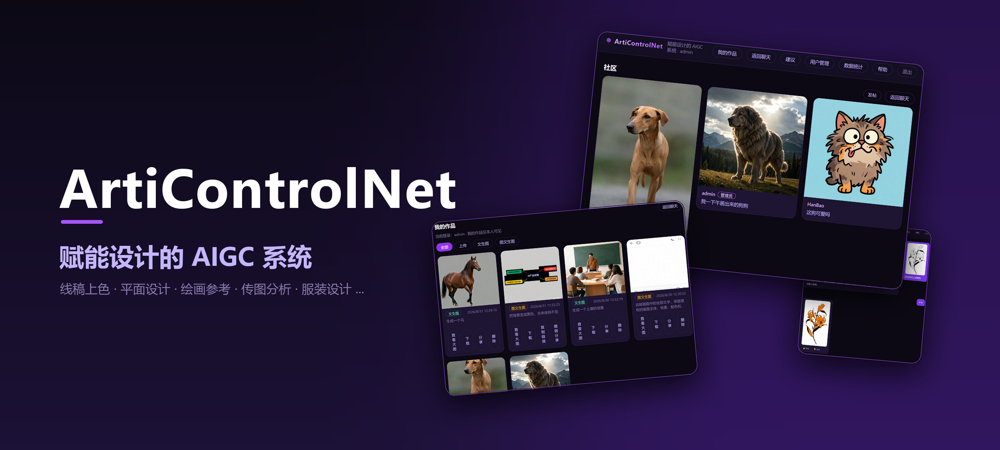
</div>

<h1 align="center">ArtiControlNet</h1>

<p align="center">
  <b>线稿画完，上色能拖三天。</b><br>
  线稿上色 · 平面设计 · 绘画参考 · 传图分析 · 服装设计 ... 说句话就行。
</p>

<p align="center">
  
  
  
  
</p>

<p align="center">
  <a href="mailto:frostyj@qq.com?subject=%E6%88%91%E6%83%B3%E8%AF%95%E7%94%A8%20ArtiControlNet">
    
  </a>
</p>

<p align="center">
  发邮件到 <b>frostyj@qq.com</b>，说一句「想试用」<br>
  GitHub 来的宝子走专属通道，我开好账号发你，打开链接登录即用
</p>

<p align="center">
  <sub>不想发邮件？<a href="https://github.com/Frosty-Jackal/ArtiControlNet/issues/new?title=%E6%88%91%E8%A6%81%E7%94%B3%E8%AF%B7%E8%AF%95%E7%94%A8%E5%8F%B7">开个 Issue</a> 也行 —— 标题已帮你填好，直接提交即可</sub>
</p>

---

## 🎨 怎么使用 ArtiControlNet？

最容易上手的三个功能：

| 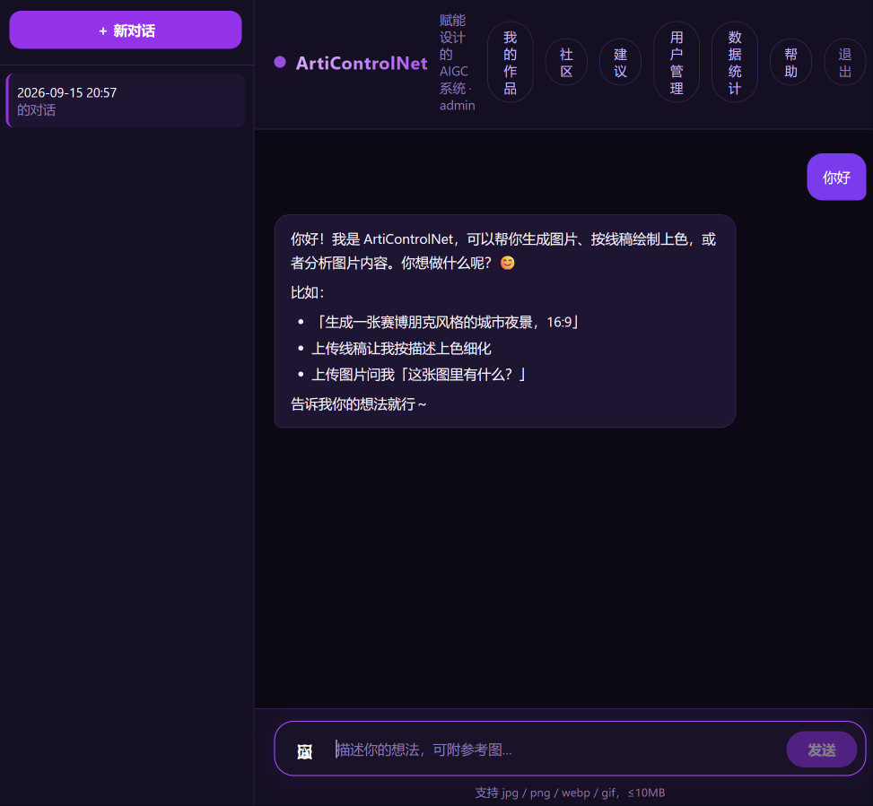 | 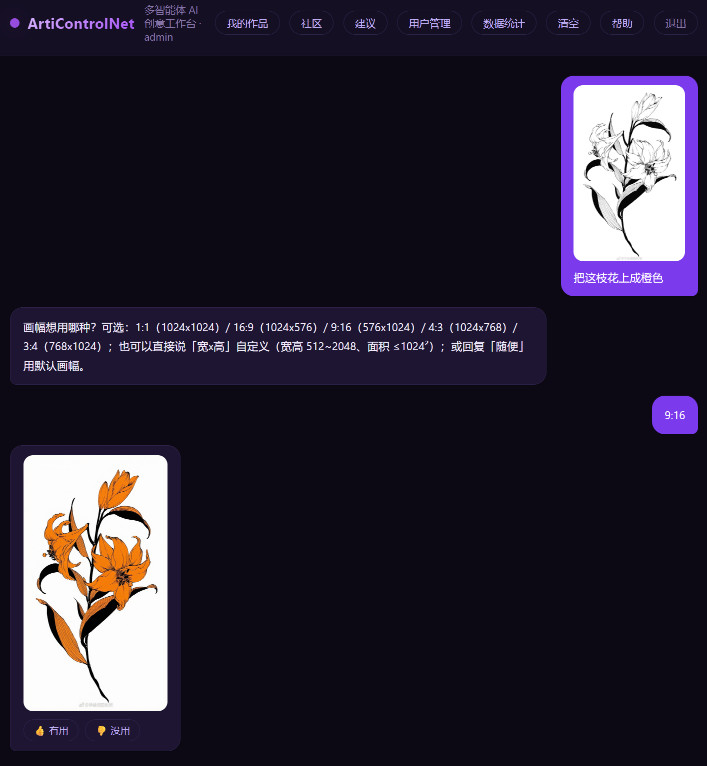 | 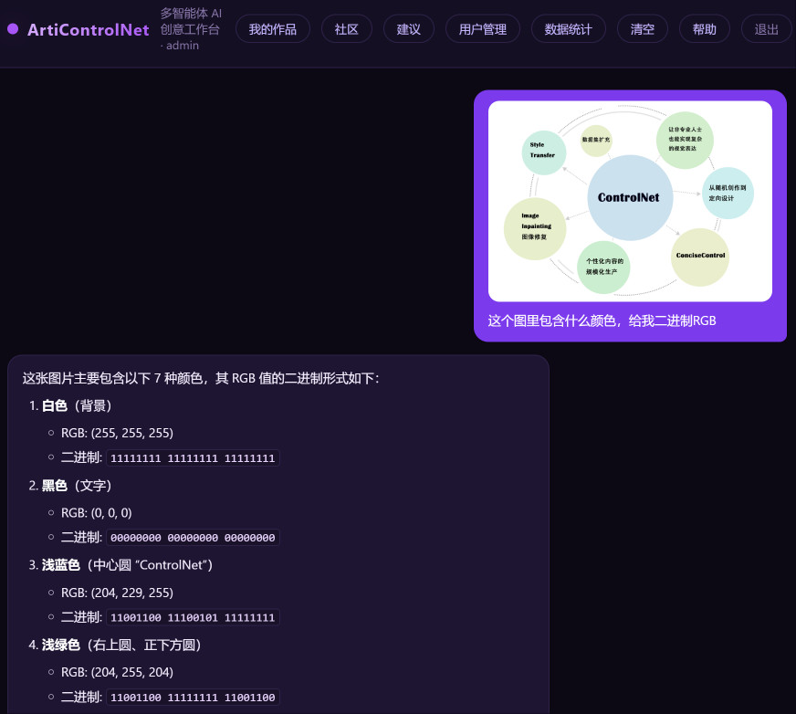 |
| :---: | :---: | :---: |
| **文生图**<br>描述你想要的画面，它生成一张新图 | **线稿生图**<br>手绘线稿传上来，指定颜色与风格，成品出来 | **图像问答**<br>传图问它，评图、打分、逐像素分析都行 |

> ✨ 更多进阶用法，等你自己探索。

## ⭐ 它会记住你的风格

ArtiControlNet 可帮你建立一份专属 **「风格档案」**。你上传或生成过的作品都可用于分析，可以在「我的作品」页一键形成自己的设计风格描述。

平时用系统用得越多，你的风格形成会越来越准！

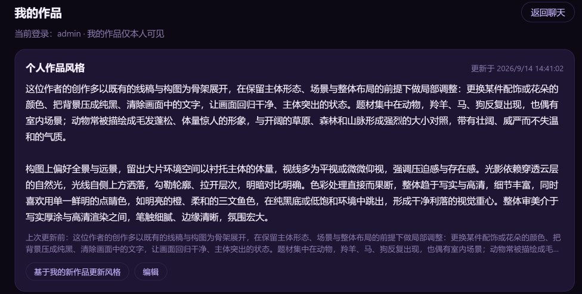

## 🖼️ 界面一览

| 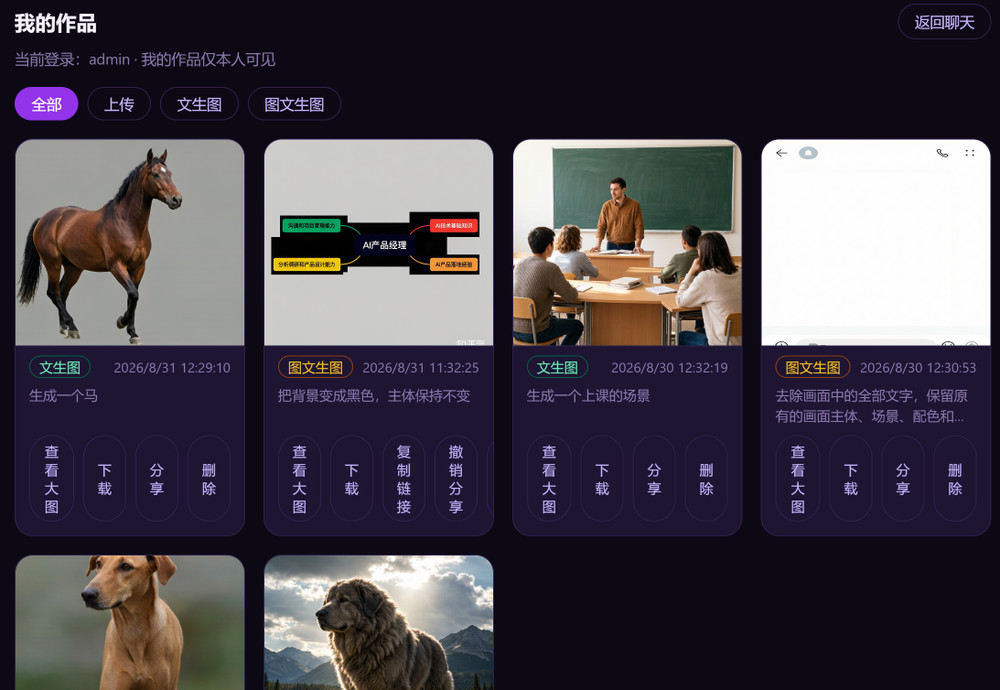 | 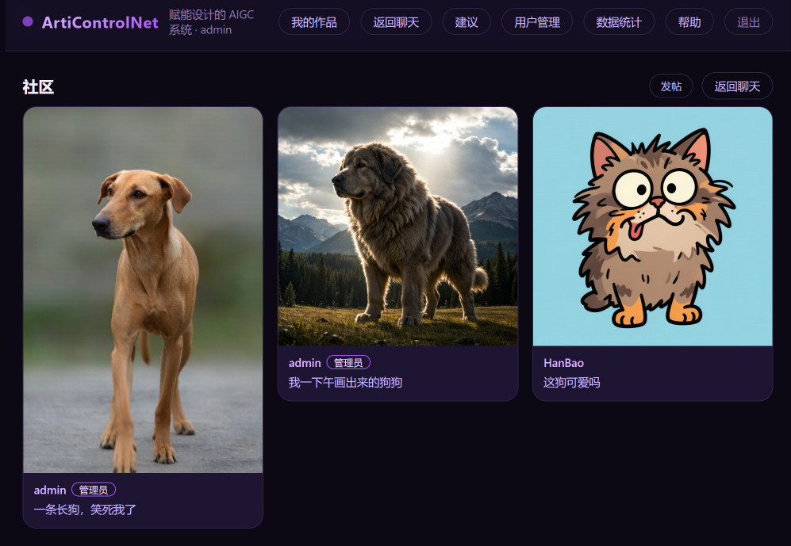 | 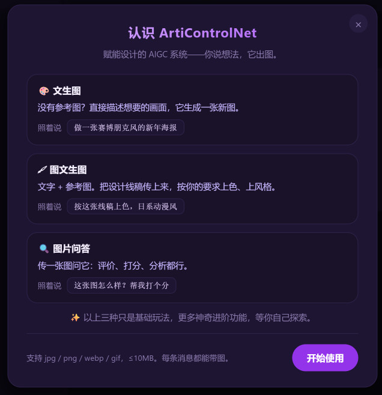 |
| :---: | :---: | :---: |
| **我的作品**<br>出过的图都在这儿，只你自己可见 | **社区**<br>想把作品晒出来时，发个帖 | **新手帮助**<br>第一次登录自动弹，跟着走一遍就会 |

## 💬 用过的人怎么说

设计专业的同学，手机上、平板上、电脑上都在用：

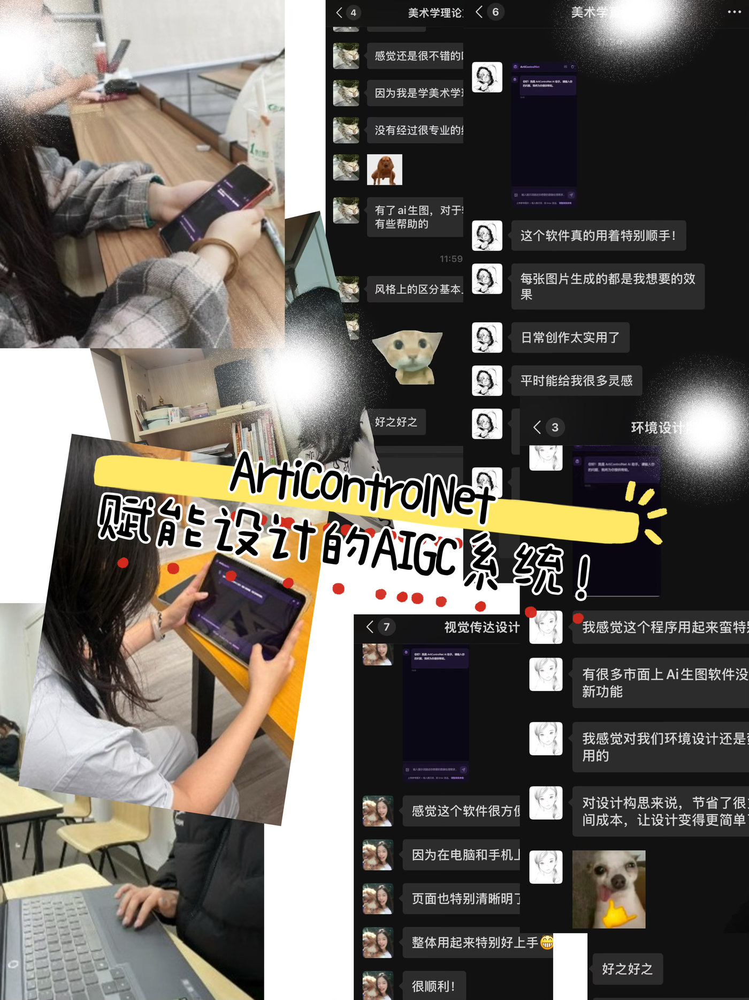

## 🏆 权威背书


而且用户提的建议，真的有人处理：

| 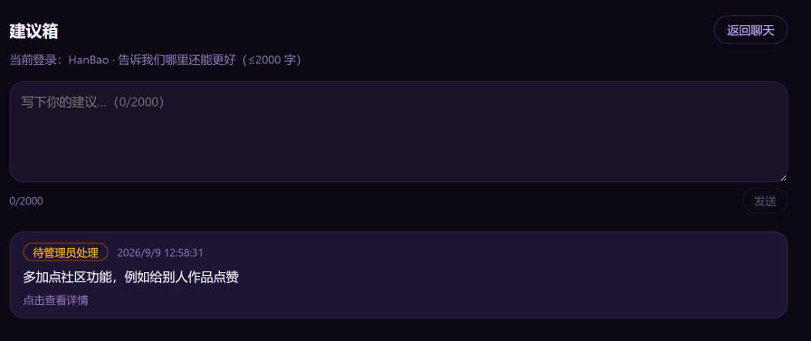 | 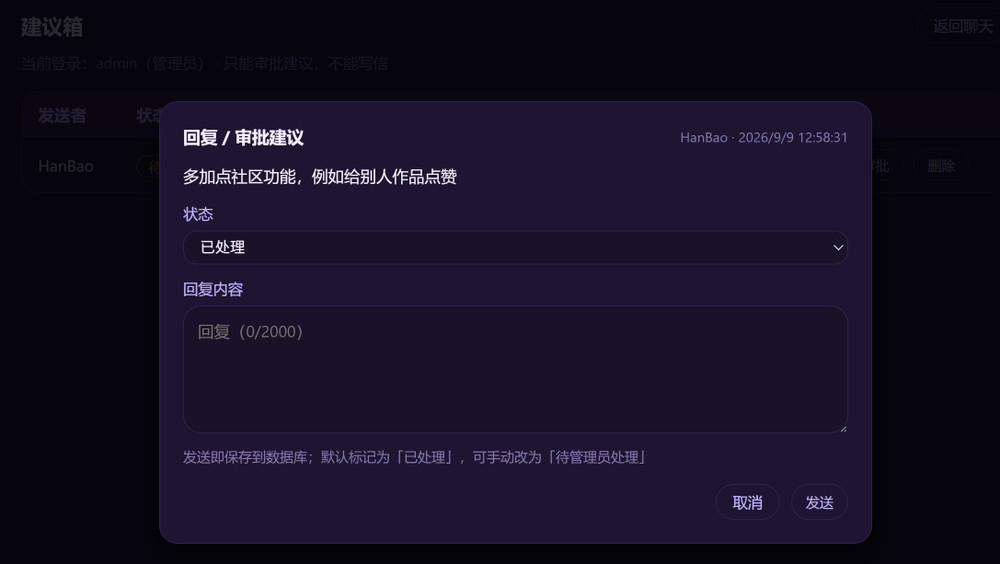 |
| :---: | :---: |
| 用户提交建议 | 管理员逐条批复、标记状态 |

## ❓ 常见问题

<details>
<summary><b>收费吗？</b></summary>

每个账号都有一定次数免费额度，用完后需要联系管理员按量付费噢（管理员邮箱 frostyj@qq.com）。
</details>

<details>
<summary><b>我完全不会画画，能用吗？</b></summary>

能。直接说人话描述你要什么就行 —— 缺信息它会反问你，不需要背提示词。
</details>

<details>
<summary><b>手机能用吗？</b></summary>

能看作品、能浏览社区；出图建议用电脑，屏幕大一些体验更好。
</details>

<details>
<summary><b>需要显卡吗？</b></summary>

不需要。所有推理都走云端模型 API，一台普通电脑（甚至只有集成显卡）就能跑起来。
</details>

## 🛠️ 它是怎么做的

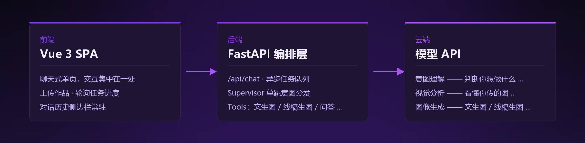

| 层 | 选型 |
|---|---|
| 前端 | Vue 3 · Vite · Pinia · Axios |
| 后端 | Python 3.10+ · FastAPI · Uvicorn · LangGraph |
| 数据 | 本地 SQLite（账号 / 对话 / 评论 / 计量 ...） |

<p align="center">
  
</p>

## 🚀 快速开始

**Windows 用户**：双击根目录的 `一键启动.bat`，它会自动建虚拟环境、装依赖、启动服务，然后打开 <http://localhost:8000> 即可。首次运行需要一点时间。

<details>
<summary><b>手动安装 / macOS / Linux / 部署给别人访问 —— 点开看完整运行说明书</b></summary>

### 一、首次安装（每台机器只装一次）

```bash
# 后端依赖 + 密钥模板
cd Server
python -m venv .venv
.venv/Scripts/python -m pip install -r requirements.txt
cp .env.example .env              # Git Bash：复制模板
Copy-Item .env.example .env       # PowerShell：复制模板（选一行）
# 复制后填入 DEEPSEEK_API_KEY、TOKENHUB_API_KEY

# 前端依赖
cd ../frontend
npm install
```

### 二、启动网站（日常就这一条命令）

```bash
cd Server
.venv/Scripts/python -m uvicorn main:app --host 0.0.0.0 --port 8000
```

启动后打开 **http://localhost:8000** 就是完整的系统 —— 前端页面和后端接口都由这一个进程提供，**不需要另外启动前端**。

### 三、让别人访问：公开链接（cloudflared 隧道，无需服务器 / 域名）

1. 确保后端已在 :8000 运行（见第二节）。
2. 首次安装 cloudflared：

   ```bash
   winget install --id Cloudflare.cloudflared
   ```

3. 新开一个终端，启动隧道：

   ```bash
   # Git Bash
   "C:\Program Files (x86)\cloudflared\cloudflared.exe" tunnel --url http://localhost:8000

   # PowerShell（带空格的路径前面必须加 &）
   & "C:\Program Files (x86)\cloudflared\cloudflared.exe" tunnel --url http://localhost:8000
   ```

4. 输出里形如 `https://xxx.trycloudflare.com` 的那一行就是公开链接，发给别人即可。

> 链接是**临时**的：每次重启隧道会变化；你的电脑需保持开机、两个终端都别关。
> 本机受 Clash / Mihomo 等代理影响，自己浏览器打开可能不稳，建议用手机流量测试或直接让访客访问。

需要**永久**域名 / 正式部署（Render、云服务器）时，另行配置，见 [Spec.md](./specs/Spec.md)。

### 四、只有改前端代码时才需要碰（平时请跳过）

```bash
# 场景 A：改了前端代码，要让改动生效
#   → 重新构建，产物交给后端托管，然后重启后端（第二节的命令）

# Git Bash
cd frontend && npm run build && rm -rf ../Server/static/* && cp -r dist/* ../Server/static/

# PowerShell（5.1 不支持 &&，逐行执行）
cd frontend
npm run build
Remove-Item -Recurse -Force ..\Server\static\*
Copy-Item -Recurse dist\* ..\Server\static\

# 场景 B：开发调试前端（:5173，改代码热更新，自动代理 /api 到 :8000）
#   → 此时需要两个进程：一个跑后端，一个跑 npm run dev，打开 http://localhost:5173

# Git Bash
cd frontend && npm run dev

# PowerShell
cd frontend
npm run dev
```

### 五、结束程序

前台运行的窗口按 **Ctrl+C** 即可停止；**直接关掉窗口也可以** —— 关闭控制台窗口会终止其中运行的进程。

若进程残留、端口被占（如重启后端时报 8000 被占用）：

```bash
# Git Bash
netstat -ano | grep :8000       # 记下最后一行的 PID（第 5 列）
taskkill //F //PID <PID>        # Git Bash 的双斜杠是转义

# PowerShell
netstat -ano | findstr :8000    # 记下最后一行的 PID
taskkill /F /PID <PID>
```

### 六、注意事项

- 图片临时存放于 `Server/storage/`（TTL 1h，服务启动时清空）；多轮看图上下文存在后端内存中，重启即失。
- `API's Usage/`、`Server/.env`、`Server/storage/` 均已 gitignore，不要手动加入提交。
- **API 密钥只放在 `Server/.env`，切勿提交或外发。** 没有密钥的话，文生图 / 线稿生图 / 图像问答都用不了。

</details>

## 📄 许可与致谢

本项目基于 [MIT License](./LICENSE) 开源 —— 你可以自由查看、学习、fork。

**致谢**：前端开发 王哲颢 · 前端 UI 设计 胡可欣 · 后端（AI）何贤哲 · 项目宣传册 章露瑶

<div align="center">
<br>
<b>如果这个东西对你的创作有帮助，点个 ⭐ Star 就是最大的支持。</b><br><br>
联系管理员邮箱：frostyj@qq.com
</div>
