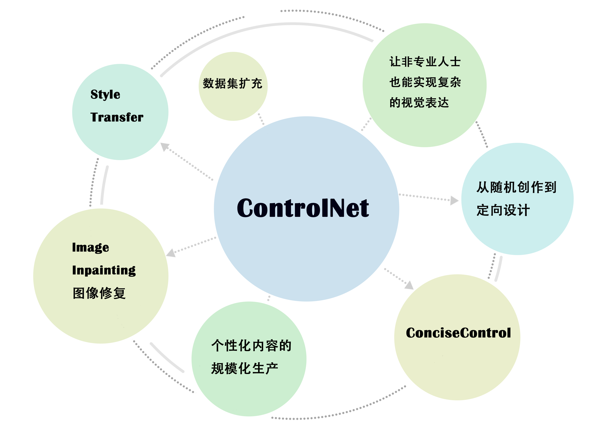
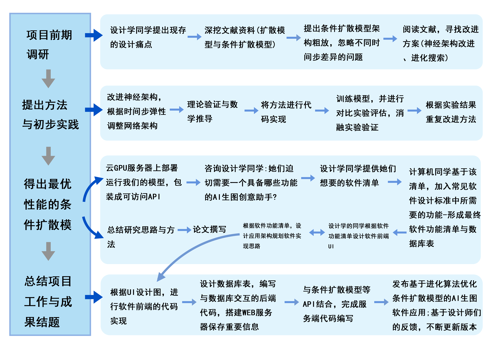
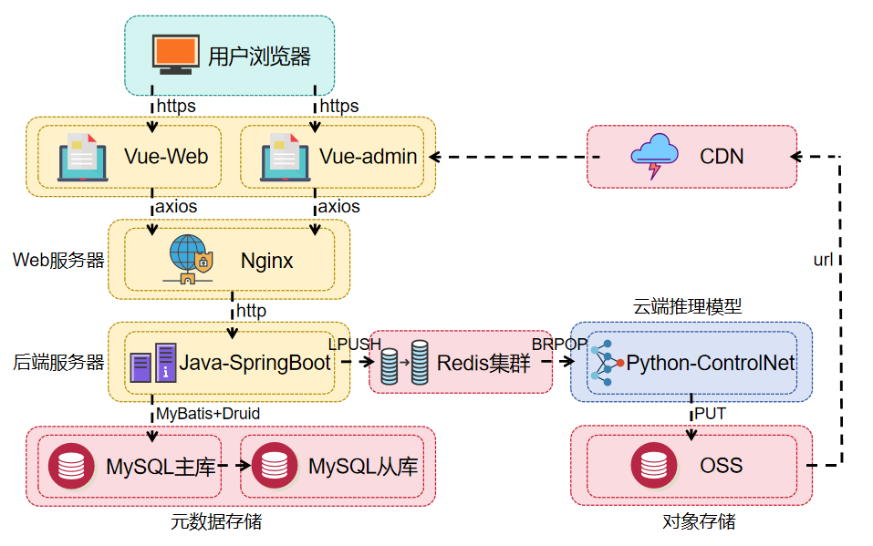
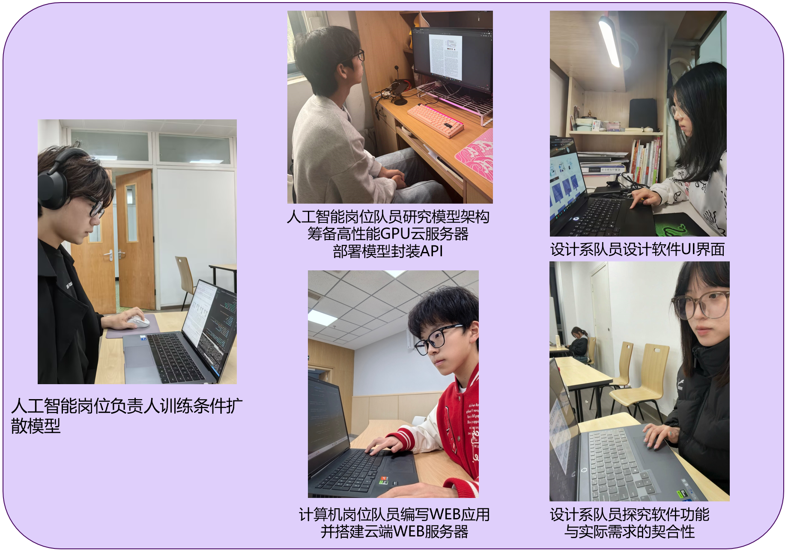

# ArtiControlNet: Empower artists with Enhanced ControlNet!

## 大学生创新项目——“基于进化算法的条件扩散模型高效架构探究”

### 亮点页面展示：

### “艺术无处不在”
### 同学，你是否思考过，条件扩散模型可以为艺术领域做什么？

### 项目的技术路线：

### 项目架构图：

## Client-end（客户端）:

- Front-end Code: Web by wzh（王哲颢）
- Front-end UI Design: by hkx（胡可欣）

## Server-end（服务端）:

- Back-end with Database : Java, Springboot by wzh（王哲颢）
- Back-end with AI: Python, FastAPI by hxz（何贤哲）

## 致谢
大家认真投入到项目研究中，每个队员都特别给力！

我们的队伍组成如下:

